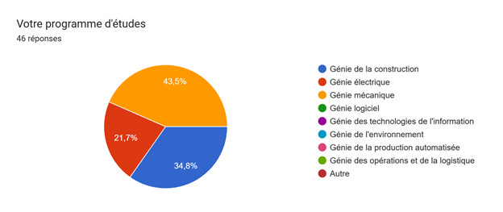
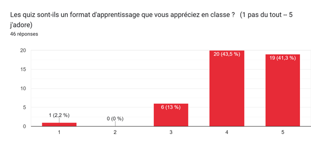
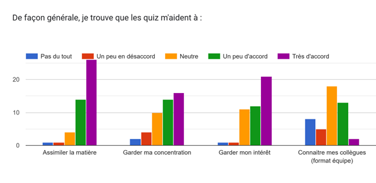
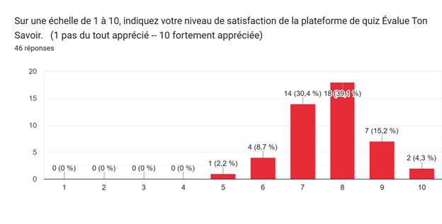
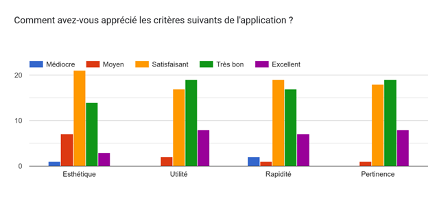

> This blog entry is in French, and presents a summary report about ÉvalueTonSavoir ([GitHub](#0)), an open-source, student response system (SRS) developed primarily by students at the École de technologie supérieure (ÉTS).



# Résultats du sondage communauté étudiante

Voici une synthèse des réponse au sondage et des commentaires des personnes étudiantes de la plateforme Evalsa réalisé en hiver 2026 à l'ÉTS.

**Nombre de répondants :** 46

**Date du rapport :** 29 avril 2026

## Profil des participants

La majorité des répondants provient des programmes de **Génie mécanique (43,5 %)** et de **Génie de la construction (34,8 %)**.
Le génie électrique complète le profil des utilisateurs avec **21,7 %** des réponses.

## Appréciation générale du format « Quiz »

Le format d’apprentissage par quiz est très largement plébiscité par les étudiants, avec une note moyenne de **4,22 / 5**.

- **Assimilation :** 87 % des étudiants sont d’accord (ou tout à fait d’accord) pour dire que les quiz aident à assimiler la matière.\
- **Engagement :** Les quiz jouent un rôle crucial pour maintenir l’intérêt et la concentration en classe.\
- **Collaboration :** L'impact sur la connaissance des collègues (format équipe) est jugé plus neutre.

## Évaluation de la plateforme Evalsa

L'application affiche un excellent taux de satisfaction global de **7,70 / 10**.

| Critère        | Appréciation majoritaire                      |
|:---------------|:----------------------------------------------|
| **Utilité**    | Excellente / Très bonne                       |
| **Pertinence** | Excellente / Très bonne                       |
| **Rapidité**   | Très satisfaisante                            |
| **Esthétique** | Satisfaisante (point d'amélioration possible) |

**Points forts relevés :**

- **Simplicité :** Connexion rapide via code QR et interface intuitive.\
- **Rétroaction immédiate :** Les étudiants apprécient de comprendre leurs erreurs tout de suite après avoir répondu.\
- **Fluidité :** Absence de procédures de connexion lourdes.

## Axes d'amélioration et problèmes techniques

Malgré une réception positive, des problèmes techniques récurrents ont été identifiés :

- **Bug de réinitialisation :** Plusieurs étudiants rapportent que leurs réponses s'effacent ou que la page se rafraîchit lorsque l'enseignant change de diapositive.\
- **Interface Mobile :** Des ajustements de mise en page sont suggérés (gestion du mode veille sur téléphone).\
- **Fonctionnalités souhaitées :** Ajout d'un "mode sombre" et d'un tableau récapitulatif des résultats personnels à la fin du test.

## Conclusion

La plateforme **Evalsa** remplit ses objectifs pédagogiques en favorisant la concentration et l'apprentissage actif.
La résolution du bug de perte de données permettrait d'atteindre un niveau de satisfaction supérieur à 9/10.
