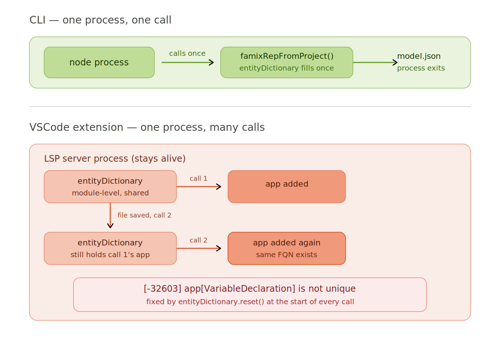

During my Mitacs Globalink 2026 internship at ÉTS Montréal, under the supervision of Christopher Fuhrman, I took over the ts2famix VSCode extension built by Lidiia Makarchuk during her own internship in 2025. Her work, described in [her post on incremental updates](../incremental-update-mitacs-2025/), had already proven the core idea: a Language Server Protocol (LSP) client/server architecture that generates Famix models from TypeScript projects directly inside VSCode, and keeps them updated as the code changes.

My contributions over these 12 weeks focused on making that prototype production-ready: extracting the extension into its own repository, publishing it on the VSCode Marketplace, exposing ts2famix as a proper library API, setting up a cross-platform CI pipeline, and adding a dedicated VSIX test workflow. This post covers the key technical decisions behind each of these contributions.

## Assumptions

This post assumes familiarity with [ts2famix](../typescript-in-moose/) and the Famix metamodel, as well as a basic understanding of how a VSCode extension is structured (client/server, LSP). The incremental update logic itself is already covered in detail in Lidiia's post.

## Extracting the Extension into Its Own Repository

The original extension lived inside the `FamixTypeScriptImporter` repository alongside the ts2famix library, which made it difficult to package, test, and distribute independently. One of the first structural contributions was extracting the extension into a dedicated repository, [FamixTypeScriptVSIX](https://github.com/Leoo-code/FamixTypeScriptVSIX), with its own dependency management, build pipeline, and CI configuration.

This separation reflects a clean architectural boundary: ts2famix is a library, and the VSCode extension is a consumer of that library. Keeping them in the same repository blurred that boundary and made it harder to version and publish each one independently.

The extraction also required fixing several setup issues that prevented the extension from running on any machine other than the original developer's: a missing `publisher` field in the configuration file, a version constraint requiring a newer VSCode than most users had, a symlink that the packaging tool `vsce` couldn't follow, and runtime dependencies installed in the wrong location.

## Publishing on the VSCode Marketplace

Once the extension was extracted and installable, the next step was making it publicly available through the VSCode Marketplace under the publisher account `Leo-maure`.

The first packaged `.vsix` weighed around 500 MB, almost entirely `node_modules`. Bundling the client and server with esbuild brought this down to approximately 4 MB, which is a meaningful difference for users installing the extension on a slower connection.

An early issue with the `.vscodeignore` configuration stripped out files the extension needed at runtime, breaking the `ts2famix.generateModelForProject` command after a fresh Marketplace install. This was a concrete illustration of the gap between "works in development" and "works after packaging": what `vsce` includes or excludes from the `.vsix` is not always what the development environment uses, and the only reliable way to catch this is to test the installed extension, not just the source.

Releases are now automated: semantic versioning scripts bump the version, commit, and tag in one command, and a GitHub Actions workflow publishes to the Marketplace automatically on every tag push.

## Architecture: Two npm Packages, One Tool

The extension is built around two separate npm packages, and understanding why they are separate is key to understanding the design.

`ts2famix` is a TypeScript-to-Famix model generator. It was originally designed as a command-line tool: you give it a glob pattern or a `tsconfig.json`, it analyzes the source files, and it writes a `model.json`. That design made perfect sense for a standalone tool, but it created a problem the moment we wanted to embed it inside a long-running VSCode extension server.

The core issue is that a CLI tool and a library have fundamentally different contracts. A CLI tool is invoked once, does its work, and exits: state can live at module level because the process is thrown away after each run. A library is imported once and called repeatedly: state that persists across calls becomes a source of bugs.

`ts2famix` was written entirely as a CLI tool. `entityDictionary`, the central object that maps every TypeScript element to its Famix counterpart, was a module-level global shared across the entire program. So were six tracking collections in `process_functions.ts`. This was fine for the CLI. It was a design flaw the moment we called `famixRepFromProject()` a second time from the extension server without the process restarting between calls.

Exposing `ts2famix` as a proper library API meant two things. First, changing the package entry point from `dist/ts2famix-cli.js` to a new `dist/index.ts` that explicitly exports only what a consumer needs: `Importer`, `SourceFileChangeType`, `getTsMorphProject`, and the helpers used by the incremental update logic. Second, making repeated calls safe by adding `reset()` and `resetProcessFunctions()` to clear all shared state at the start of each `famixRepFromProject()` invocation.

The `npm link` mechanism bridges the two packages during development: instead of publishing `ts2famix` to npm for every change, `npm link` creates a symlink so the extension server resolves `ts2famix` directly from the local source tree. This lets both packages be developed and tested together without a publish step in between.

## Exposing ts2famix as an API: Two Design Problems

After exposing the API, all 7 automated tests stayed green. But running the extension in debug mode against a real project, Emojiopoly, surfaced two bugs that no unit test had been designed to catch.

### Designing for Repeated Invocation

The global-state problem was not a bug in the traditional sense: it was a design assumption that held perfectly for a CLI and broke entirely for a library. The solution was to recognize that `famixRepFromProject()` needed to behave like a pure function, producing the same model from the same project regardless of how many times it had been called before.

This led to two additions to the API surface. `EntityDictionary.reset()` recreates the `FamixRepository` and clears all internal maps (classes, interfaces, modules, variables, functions, import clauses, enums, inheritances). `resetProcessFunctions()` clears the six module-level collections in `process_functions.ts` that track accesses, invocables, classes, interfaces, modules, and export maps between passes. Both are called at the start of every `famixRepFromProject()` invocation.

*A command-line run starts fresh every time. The extension server stays running and calls the same function repeatedly: without clearing state between calls, entities accumulate until the model's consistency check catches the duplicates.*

### Bundling a Library, Not a CLI

The second design issue was about what esbuild should include in the server bundle. With `external: []`, esbuild treated `ts2famix` as just another dependency to inline, which meant inlining its CLI entry point, including the `yargs` argument parser that runs immediately on `require`. The server was not importing a library; it was accidentally executing a program.

The fix, `external: ['ts2famix']`, reflects the correct mental model: `ts2famix` is a peer dependency that the runtime environment is responsible for resolving, whether via `npm link` in development or `node_modules` in production. The bundler should not own it.

![esbuild bundling with external:[] vs external:['ts2famix']](bug-esbuild.png)

*With `external: []`, esbuild inlines ts2famix's CLI entry point into the bundle, where it executes on startup and crashes the server. Marking `ts2famix` external leaves it to be resolved at runtime instead.*

### Validation

Both fixes were validated against the full test suite and against a real project. The 7 automated smoke tests passed, model generation against Emojiopoly succeeded with no crash and no FQN error, 886 entities were generated without error via direct CLI invocation on the same project, and the resulting `model.json` loaded successfully in Moose/Pharo.

## Testing the VSIX

Testing the extension from source (pressing F5 in VSCode) is not the same as testing what a user actually installs. The packaged `.vsix` goes through `vsce`, which applies `.vscodeignore` rules, resolves dependencies differently, and produces a bundle that may behave differently from the development environment.

To address this, a dedicated `npm run test:vsix` workflow was added alongside the existing smoke tests. This script packages the extension into a `.vsix`, installs it in an isolated VSCode instance, and runs the test suite against the installed version, the same way an end user would experience it. The workflow runs on the CI matrix (Ubuntu, macOS, Windows) on every push, giving early warning of packaging regressions before they reach the Marketplace.

Two build scripts support different development scenarios. `npm run build` installs `ts2famix` from npm and rebuilds the server bundle, which is the standard case for testing the extension against the published library. `npm run build:local` runs the full `npm link` workflow, building `ts2famix` from the local source tree and linking it into the extension server, which is the case for developing both packages simultaneously.

## Using AI Assistance: Contributions and Limits

A significant part of the work during this internship was done in collaboration with an AI assistant (Claude, Copilot). This collaboration was genuinely productive for certain tasks: generating boilerplate, drafting documentation, suggesting fixes for well-defined bugs, and helping navigate unfamiliar APIs quickly.

That said, working with an AI assistant on a real codebase surfaced clear limits that are worth documenting honestly.

The most consistent issue was context. The AI assistant did not have access to the full repository history, the existing test suite, or the runtime behavior of the extension. This meant that suggested fixes sometimes addressed the symptom rather than the root cause, and had to be validated manually against the actual codebase. For example, the `sourceAnchor` bug required iterating through several hypotheses before identifying that the real issue was a missing `override get` paired with an `override set` in TypeScript's class hierarchy, something that only became clear by reading the compiled JavaScript output and adding diagnostic logs.

A second limit was autonomy. AI agents tend to propose solutions and proceed without always waiting for confirmation, which can lead to changes accumulating faster than they can be reviewed. On a project where correctness matters (a published extension used by real users), this required actively slowing down the AI's suggestions and verifying each change independently before committing.

The practical takeaway is that AI assistance accelerates certain kinds of work significantly, particularly documentation, boilerplate, and first-pass debugging, but it does not replace the need for a developer who understands the system well enough to validate the output. The AI is as useful as the context it is given, and providing that context is itself a skill.

## What's Next

Several directions remain open for future contributors. The global-state design in `entityDictionary` and `process_functions.ts` is now patched to work correctly under repeated invocation, but the long-term fix would move `entityDictionary` into the `Importer` class as a private property, making each instance fully independent. The event trigger question, `onDidChangeWatchedFiles` versus `onDidSaveTextDocument`, is still open and worth revisiting. The CI pipeline should be extended to test against the npm-published version of `ts2famix` rather than only the GitHub-pinned version, to catch API mismatches before they reach users.
